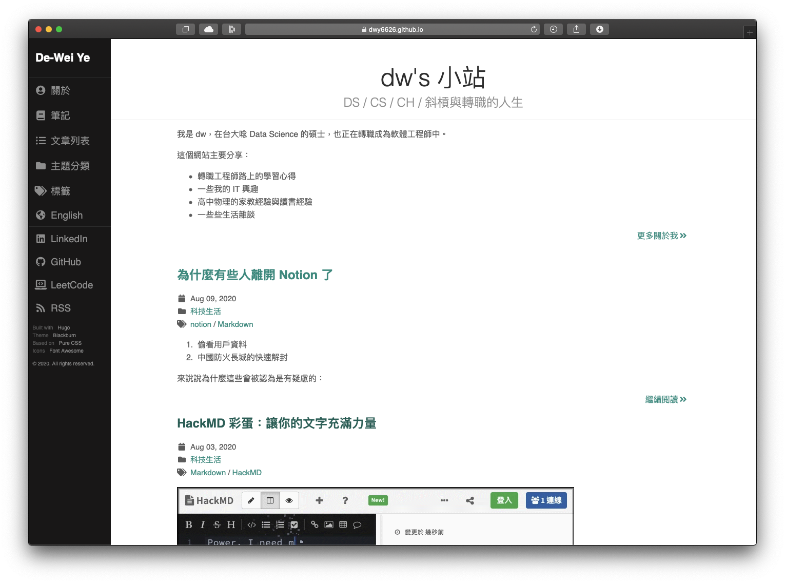

# DW-Favored-Blackburn

Since the [original repo](https://github.com/yoshiharuyamashita/blackburn) is not updated for a long time, I decide to fork this theme and modify it for my website.  

The test version is `0.74.3`

## Changelog from [Blackburn](https://github.com/yoshiharuyamashita/blackburn)

some important things:

- All images are responsive now! (no need to add `fluid_img` shortcode for every images)
- [Make the side menu scrollable](https://github.com/yoshiharuyamashita/blackburn/issues/92)
- [Reading Time](https://github.com/yoshiharuyamashita/blackburn/issues/89)
- OG and Twitter card support (for social media sharing)
  - [Twitter validator](https://cards-dev.twitter.com/validator)
  - [Facebook sharing debugger](https://developers.facebook.com/tools/debug/)
- Copyright BY-CC-ND 4.0 in each post
- Use Hugo default pagination

- Color customization
- [i18n support](https://gohugo.io/content-management/multilingual/)
- `404.html`
- better w3c
  - preconnect to imgur
  - [aria-label](https://www.w3.org/TR/using-aria/)
  - [better SEO](#seo-of-my-website)
- Larger texts in menu 
- RSS template in `layouts/rss.xml`
- New list format (less redundancy)
- Mathjax configuration in `layouts/partials/mathjax.html`

The full changelog is too long (and I don't remember... sorry) to list.

## [Blackburn](https://github.com/yoshiharuyamashita/blackburn)

a clear and responsive theme for [Hugo](//gohugo.io).

## Overview

* Based on Yahoo's [Pure CSS](http://purecss.io/) (v1.0.0)
* Social links: (I delete a lot link lol)
  * LinkedIn
  - LeetCode
  * GitHub

* Client-side syntax highlighting by [Highlight.js](//highlightjs.org)
* Web analytics by Google Analytics
* Comments by Disqus
* Icons by Font Awesome

## Demo

- [Project Site](https://dwy6626.github.io/dw-favored-blackburn-example/)
- [My site](https://dwy6626.github.io/)



### SEO of my website


## Installation

In your Hugo site directory, run:

```shell
$ mkdir themes
$ cd themes
$ git submodule add https://github.com/dwy6626/dw-favored-blackburn.git themes/dw-favored-blackburn
```

See [Hugo Quickstart Guide](//gohugo.io/overview/quickstart/) for more information.

## Configuration

Refers to https://github.com/dwy6626/dw-favored-blackburn-example/blob/master/config.toml

## Usage

* Write Markdown files in `content/post`
* Add fixed pages (e.g., about.md) to the side menu by defining them under `[menu]` in the config.toml:

```toml
[[menu.main]]
  name = "About"
  pre = "<i class='fa fa-user fa-fw'></i>"
  weight = 2
  identifier = "about"
  url = "/about/"
```

* Override the theme by linking to custom CSS files or URLs:

```toml
[params]
  custom_css = ["css/my.css"]
```

* Add new behaviours by linking to custom JS files or URLs:

```toml
[params]
  custom_js = ["js/my.js", "https://cdnjs.cloudflare.com/ajax/libs/zooming/1.4.2/zooming.min.js"]
```

## Shortcodes

### pure_table
```

```

where each positional parameter is separated by the vertical bar (i.e., |). The resulting `<table>` is set to have `class="pure-table pure-table-striped"`.

### fluid_imgs

```

```

where each positional parameter is separated by the vertical bar (i.e., |).

- `class`: specifies a Pure CSS unit class name (**required**)
- `src`: specifies the URL of an image (**required**)
- `alt`: specifies an alternate text for an image (optional)

See [here](http://yoshiharuyamashita.com/post/hugo-shortcode-to-show-multiple-images/) for examples.

## License

* [MIT](//opensource.org/licenses/MIT)
